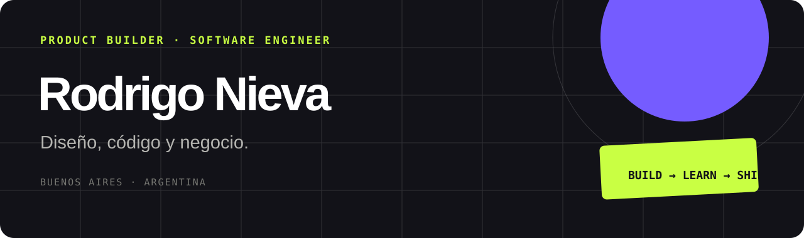

<p align="center">
  
</p>

<p align="center">
  <a href="https://nievarodrigo.github.io/"><b>Portfolio</b></a>
  &nbsp;·&nbsp;
  <a href="https://www.linkedin.com/in/rodrigonieva/"><b>LinkedIn</b></a>
  &nbsp;·&nbsp;
  <a href="mailto:nievarodrigo40@gmail.com"><b>Email</b></a>
</p>

## Hola, soy Rodrigo 👋

**Diseño, construyo y lanzo productos digitales.** Trabajo en el punto donde se cruzan producto, ingeniería y negocio: desde SaaS con pagos y permisos complejos hasta experiencias realtime y landings orientadas a conversión.

No me interesa acumular demos. Me interesa **llevar ideas a producción**, aprender de usuarios reales y convertir problemas concretos en software claro y confiable.

### Productos destacados

| Producto | Qué resuelve | Tecnologías | Estado |
|---|---|---|---|
| **[FiloDesk](https://filodesk.app)** | Gestión integral para barberías, peluquerías y centros de estética: turnos, caja, ventas, gastos, stock, equipos y métricas. | Next.js · TypeScript · Supabase · Rebill · Mercado Pago | Producción |
| **[Juntadita](https://michucumple.vercel.app)** | Juegos multijugador para fiestas con trivia, bingo, votaciones y dinámicas controladas por un host. | Next.js · Supabase Realtime · Framer Motion | Producción |
| **[Landings que venden](https://solpilates.vercel.app)** | Diseño y desarrollo de sitios a medida para negocios, con identidad, mensaje y conversión directa. | Estrategia · UI/UX · HTML · CSS · JS | Servicio activo |

### Cómo trabajo

```text
Problema → Estrategia → Experiencia → Ingeniería → Producción → Aprendizaje
```

- **Producto:** convierto necesidades difusas en una propuesta clara y validable.
- **Ingeniería:** diseño frontend, APIs, datos, permisos, pagos y operaciones.
- **Lanzamiento:** cuido el mensaje, la conversión, el deploy y la calidad final.

### Stack actual

<p>
  
  
  
  
  
  
  
  
</p>

También trabajo con arquitectura multi-tenant, RLS, realtime, integraciones de pago, testing, observabilidad y agentes de IA aplicados al ciclo de desarrollo.

### En formación continua

- **Ingeniería en Informática** — UADE, en curso.
- **Generative AI: Zero to Hero Academy** — Google.
- **Google Cloud Computing Foundations** — Google.

---

<p align="center">
  <b>¿Tenés una idea que merece existir?</b><br />
  <a href="mailto:nievarodrigo40@gmail.com">Hablemos y hagámosla real →</a>
</p>
